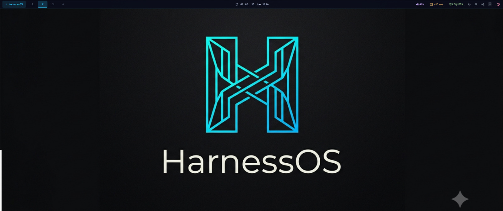
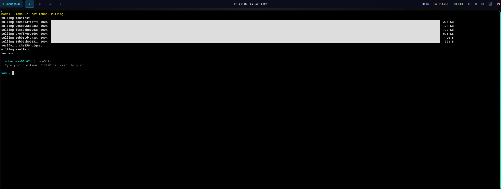
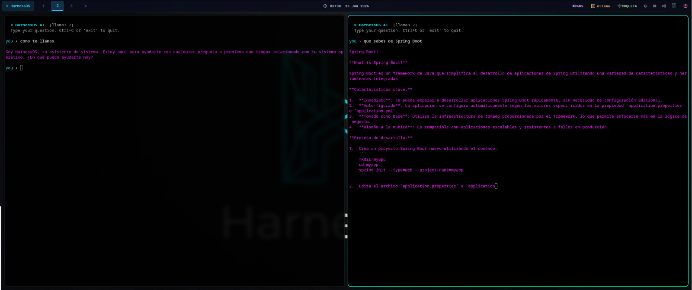
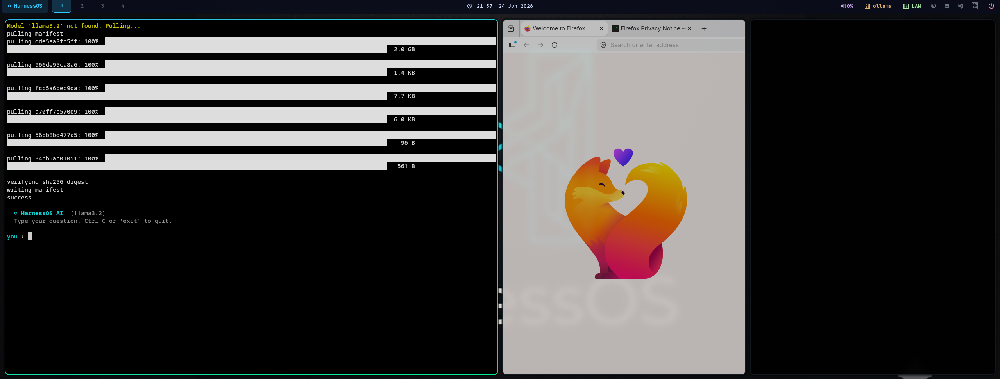
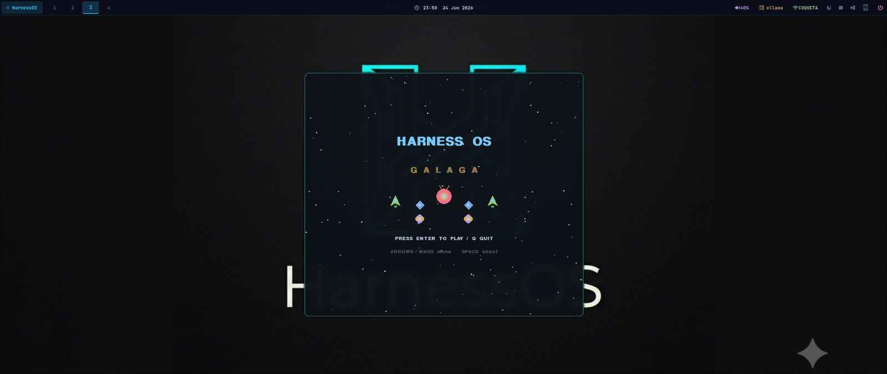

# HarnessOS

**Arch Linux re-imagined for AI-powered software development.**

[](https://github.com/Codigo-Free/HarnessOS/actions/workflows/build-iso.yml)
[](https://github.com/Codigo-Free/HarnessOS/releases)
[](http://148.113.174.52:8899/harnessOS-2026.06.23-x86_64.iso)
[](LICENSE)

Boot into a complete AI development environment in minutes. Claude CLI, Ollama, Docker, Hyprland, and 40+ dev tools — configured, themed, and ready. No manual setup required.

---

## Screenshots


*HarnessOS — desktop with Waybar and logo wallpaper*


*`harness ai` — pulls llama3.2 on first run and starts a context-aware AI session*


*`harness ai` split pane — two concurrent AI conversations running side by side*


*Split view — terminal alongside Firefox, all running in Hyprland*


*`SUPER+SHIFT+CTRL+G` — hidden Galaga game (Tokyo Night palette)*

---

## Why HarnessOS?

You spend days setting up a new machine. Installing packages, configuring dotfiles, authenticating CLI tools, tuning the compositor. HarnessOS eliminates that entirely — everything is pre-configured and ready on first boot.

| | HarnessOS | Arch Linux | EndeavourOS | Ubuntu |
|--|:---------:|:----------:|:-----------:|:------:|
| Claude CLI (AI pair programmer) | First boot | Manual | Manual | Manual |
| Ollama + local LLM | First boot | Manual | Manual | Manual |
| System-aware AI (`harness ai`) | Built-in | — | — | — |
| Hyprland tiling Wayland | Pre-configured | DIY | Optional | — |
| TUI tools (lazygit, k9s, yazi...) | Pre-installed | Manual | Manual | Manual |
| BTRFS + auto-snapshots | Default | Manual | Manual | — |
| linux-zen kernel | Default | Optional | Optional | — |
| Developer profiles | `harness install` | — | — | — |
| NVIDIA (linux-zen safe) | Auto-detected | Manual | Manual | Manual |
| TUI installer | Yes | `archinstall` | Yes | Yes |

---

## Download

| Version | Date | Size | Link |
|---------|------|------|------|
| **v2026.06.24** (latest) | 2026-06-24 | 3.0 GB | [harnessOS-2026.06.24-x86_64.iso](http://148.113.174.52:8899/harnessOS-2026.06.24-x86_64.iso) |

```bash
# Download
wget http://148.113.174.52:8899/harnessOS-2026.06.24-x86_64.iso

# Verify checksum
wget http://148.113.174.52:8899/harnessOS-2026.06.24-x86_64.iso.sha256
sha256sum -c harnessOS-2026.06.24-x86_64.iso.sha256

# Flash to USB
sudo dd if=harnessOS-2026.06.24-x86_64.iso of=/dev/sdX bs=4M status=progress oflag=sync
```

> The ISO boots straight to Hyprland. Run `harness-install` from the terminal to install to disk.

---

## Quick Install

```bash
# 1. Boot from USB → open terminal (Super+Return)
harness-install          # TUI wizard: disk, user, GPU, software

# 2. After reboot
harness setup            # authenticate Claude, GitHub, pull Ollama model
harness doctor           # verify GPU, Docker, Ollama, Claude CLI

# 3. Start working
harness ai               # AI that knows your system
claude                   # AI pair programmer
code .                   # VS Code
```

The installer handles: BTRFS partitioning + subvolumes, GPU driver detection, dotfile deployment, and systemd-boot setup. Takes ~10 minutes.

---

## The `harness` CLI

One command as the central interface to everything:

```bash
harness info                           # hardware, kernel, services, Ollama models
harness doctor                         # verify all tools — shows fix hints for failures
harness setup                          # wizard: GitHub, Claude, Ollama model
harness update                         # safe update: snapshot before, verify after
harness snapshot -m "before refactor"  # manual BTRFS snapshot
harness snapshot --list                # list all snapshots
harness install web                    # add Web Dev profile
harness install ml                     # add ML/CUDA profile
harness install devops                 # add DevOps profile
harness install security               # add Security profile
harness ai                             # system-aware AI chat
harness ai --explain "docker rm -f …" # explain a command before running
```

`harness doctor` example:

```
  GPU:     NVIDIA RTX 4080 — nvidia-dkms 560.x installed
  Docker:  running v26.1
  Ollama:  running — llama3.2 (2.0 GB)
  Claude:  authenticated
  Git:     2.45.2
  Node:    v22.4.0
  pnpm:    not found — run: harness install web
```

---

## `harness ai` — AI That Sees Your System

Unlike a generic chatbot, `harness ai` injects your real system state into every conversation: kernel version, disk usage, failed services, running containers, and your last 20 shell commands.

```
$ harness ai
Model: llama3.2  |  Session: 2026-06-23-001

You: why is docker failing to start?

  I can see from your system state that docker.service entered a
  failed state 3 minutes ago. The journal shows a conflict with
  the rootless socket. Run these to fix it:

    [1]  sudo systemctl restart docker
    [2]  sudo usermod -aG docker $USER && newgrp docker

  Run which command? [1/2/a/n] > 1
```

- Commands require your approval before executing
- Conversation saved to `~/.local/share/harness/ai-sessions/`
- Model configurable in `~/.config/harness/config.toml`
- Waybar shows live Ollama status — click to open `harness ai`
- `SUPER+A` opens it instantly from anywhere on the desktop

---

## What Ships Pre-installed

### AI Tools

| Tool | Command | Notes |
|------|---------|-------|
| harness ai | `harness ai` | System-aware chat — sees kernel, services, Docker, history |
| Claude CLI | `claude` | AI pair programmer by Anthropic |
| Ollama | `ollama` | Run LLMs locally (llama3.2, mistral, codestral…) |
| GitHub Copilot | `gh copilot` | Copilot from the terminal |

### Desktop

| Tool | Notes |
|------|-------|
| Hyprland | Tiling Wayland compositor — fast, GPU-rendered |
| Waybar | Top bar: workspaces, Ollama status, clock, volume |
| Kitty | GPU-accelerated terminal, Tokyo Night theme |
| Firefox | Browser |
| VS Code | Editor |
| Wofi | App launcher |

### TUI Tools

| Alias | Tool | What it does |
|-------|------|-------------|
| `lg` | lazygit | Git staging, commits, diffs, branches |
| `lzd` | lazydocker | Docker containers, images, logs |
| `y` | yazi | File manager — exits and `cd`s to last dir |
| `z <dir>` | zoxide | Smart `cd` — learns your most-used dirs |
| `top` | bottom | Process and resource monitor |
| `logs` | lnav | Log file navigator with filtering |
| `k` | k9s | Kubernetes cluster TUI |
| `vim` | neovim | Editor with LSP + Copilot |

Shell aliases: `ls` → eza, `cat` → bat, `d` → docker, `dc` → docker compose.

### Dev Stack

| Stack | What's included |
|-------|----------------|
| Python 3 | pip, pipx, uv, virtualenv |
| Node.js LTS | npm, pnpm, TypeScript, ts-node, tsx |
| Containers | Docker + Compose + nvidia-container-runtime |
| Java | OpenJDK + Maven |
| .NET | SDK |
| PHP | + Composer |
| Kubernetes | kubectl |

---

## Developer Profiles

Install additional tool stacks after initial setup:

```bash
harness install web       # pnpm, Bun, TypeScript, Next.js, Vercel, Tailwind
harness install ml        # CUDA, PyTorch, Jupyter, pandas, transformers, huggingface
harness install devops    # Terraform, Ansible, Helm, kubectx, AWS CLI
harness install security  # nmap, Wireshark, hashcat, John, sqlmap, gobuster
```

---

## Keybindings

| Keys | Action |
|------|--------|
| `Super + Return` | Terminal (Kitty) |
| `Super + A` | HarnessOS AI (`harness ai`) |
| `Super + C` | Claude CLI |
| `Super + O` | Ollama chat |
| `Super + R` | App launcher (Wofi) |
| `Super + B` | Firefox |
| `Super + E` | VS Code |
| `Super + H/J/K/L` | Focus window (vim-style) |
| `Super + 1–4` | Switch workspace |
| `Super + Shift + 1–4` | Move window to workspace |
| `Super + W` | Close window |
| `Super + F` | Fullscreen |
| `Print` | Screenshot (select area) |

---

## Build from Source

**Any Linux host with Docker (Arch not required):**

```bash
git clone https://github.com/Codigo-Free/HarnessOS.git
cd HarnessOS
./scripts/build-docker.sh
```

**Arch Linux host:**
```bash
sudo ./scripts/build.sh
```

**Test in QEMU after building:**
```bash
./scripts/test-qemu.sh
```

---

## Technical Notes

**BTRFS subvolume layout:**

| Subvolume | Mount | Mount options |
|-----------|-------|---------------|
| `@` | `/` | `noatime,compress=zstd:1,space_cache=v2` |
| `@home` | `/home` | same |
| `@var` | `/var` | same |
| `@var_log` | `/var/log` | same |
| `@snapshots` | `/.snapshots` | snapper snapshot storage |
| `@swap` | `/swap` | `chattr +C` (NoCoW — required for swapfile on BTRFS) |

**NVIDIA:** Always installs `nvidia-dkms` (not `nvidia`) — required for the linux-zen kernel. Docker is automatically configured with `nvidia-container-runtime`.

**Snapshots:** Every `pacman` transaction triggers pre/post snapshots via `snap-pac`. Roll back with:
```bash
snapper list
snapper undochange 42..43
```

---

## Documentation

| Doc | Description |
|-----|-------------|
| [Overview](docs/01-overview.md) | What is HarnessOS, design principles, target audience |
| [Building](docs/02-building.md) | Build from source — Docker or native Arch |
| [Live Environment](docs/03-live-environment.md) | Keybindings, Waybar, TUI tools, first-boot setup |
| [Installation](docs/04-installation.md) | TUI installer walkthrough, disk layout, GPU setup |
| [AI Tools](docs/05-ai-tools.md) | Claude, Ollama, harness ai — usage and configuration |
| [Troubleshooting](docs/06-troubleshooting.md) | Boot, login, build issues and solutions |
| [Changelog](CHANGELOG.md) | Version history |

---

## Contributing

Pull requests are welcome — packages, dotfile improvements, new profiles, bug fixes.
See [CONTRIBUTING.md](CONTRIBUTING.md) for how to build, test, and submit changes.

---

## License

GPL-2.0 © [Codigo-Free](https://github.com/Codigo-Free)
